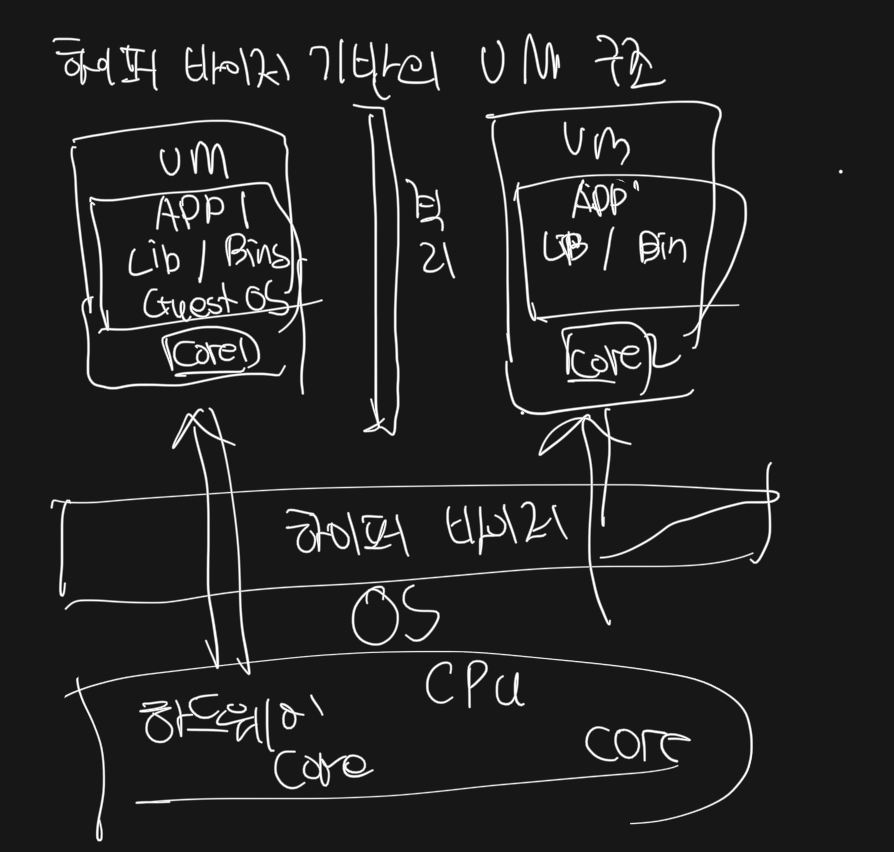

# Docker

## 도커를 쓰는 이유는 무엇일까
- Node, kakao installer 설치 및 실행하기가 번거로움
- installer 운영ㅇ 체제에 많은 영향은 간다. linux 도 알고 보면 까다롭다
- Docker 설치를 한번 해놓으면 편하다

## 도커란 무엇인가
- 컨테이너를 사용하여 응용프로그램을 더쉽게 배포하고 실행할수 잇도록 하는것
- 일반적인 컨테이너 개념: 아무거나 넣고, 차 과일 옷들을 보관할수잇는것
- 도커에서 컨테이너: 다야항 프로그램, 실행환경을 추상화해서 동일한 인터페이스를 제공하여 배포를 단순화 하는것,물건을 손쉽게 배포 및 관리 할수잇는것

## 도커이미지 컴ㄴ테이너 정의 알아보가
- 도커 이미지: 응용 프로그램을 실행하는 모든것을 가지고 잇는것(프로그램을 실행하는데 필요한 설정 종속성)
- 도커 컨테이너: 도커 이지를 인스턴화 한것. 이미지를 이용해서 컨테이서 생성해 프로그램을 실행시킬수 잇다
- (?)컨테이너는 코드와 모든 종속성을 패키지화 하는것이다

## Docker run hello-world
- run 명령어 실행시 이미지가 없으면 hub 에서 검색후 가져온다.

## Docker 기술에 대한 이해
- 가상화 기술전: 한대의 서버 하나의 용도, 남은 서버공간이 방치 된다. 안전하지만 비효율적이다
- 하피어바이저: 네이티브,호스트 하이버 바이저(현재 가장 많이 사용) 종류가있다

~~~
하이퍼 바이저 호스트 운영체제 위에 바로 게스트 운영체제를 실행하지 않고, 먼저 하이퍼바이저라는 중간 계층을 두어 하이퍼바이저가 호스트 운영체제와 하드웨어 간의 인터페이스 역할을 수행하게 됩니다. 이렇게 하이퍼바이저는 호스트 운영체제와 각각의 게스트 운영체제 간에 중재자 역할을 하며, 각각의 게스트 운영체제는 독립적으로 실행될 수 있습니다.

즉, 하이퍼바이저는 하드웨어를 가상화하여 가상머신(VM)을 생성하고, 이를 통해 각각의 게스트 운영체제가 하드웨어 자원을 독립적으로 사용할 수 있도록 해줍니다. 이렇게 하이퍼바이저를 사용하면, 하드웨어를 더 효율적으로 사용할 수 있으며, 시스템의 안정성과 보안성도 향상됩니다.

대표적인 하이퍼바이저 기술로는 VMware, KVM, Xen 등이 있습니다. Docker는 하이퍼바이저 기술을 사용하지 않고, 호스트 운영체제 위에서 가상화를 구현하는 컨테이너 기술을 사용합니다.
~~~

## 명령어 정리

### docker run 이미지명 ls
~~~
bin dev etc home lib media mnt opt proc root run sbin srv sys tmp usr var
~~~
- run 다음에 명령어를 실행시킬수 있다
- but hello-world 이미지는 실행이 안된다 `executable file not found in $PATH: unknown.`

### docker ps
- 도커클라이언트 process status
- Docker run alpine ping localhost([ping 을 던져서 서버 실행해봄])
- Docker ps 를 통해서 실제 도커 상태를 관찰할수있음
~~~
CONTAINER ID   IMAGE     COMMAND            CREATED      STATUS      PORTS     NAMES
6738f64e9d33   alpine    "ping localhost"   6 days ago   Up 6 days             vigilant_wing
~~~
- docker ps -a 전체 이력 보기

### Docker Run 의 의미
- docker create + docker start 를 포함한다

### Docker Stop, Kill
`docker stop [containerId]` Gracefully 하게 중지 시킵니다.(정상적인 일반 종료느낌)
`docker kill [containerId]` Stop 과  달리 바로 중지시킨다. 정ㅅ지할 시간을 안주고 바로 정지시키는것

### Docker rm + 컨테이너 아이디/이름
- 전체 삭제 Docker rm ‘docker ps -a -q’
~~~
docker stop은 실행중인 컨테이너를 정지(stop)하는 데 사용됩니다. 이 명령어를 실행하면 컨테이너의 실행이 중지됩니다. 컨테이너의 상태는 "Exited"로 변경되며, 컨테이너는 여전히 시스템에 존재합니다.

docker rm은 컨테이너를 삭제(remove)하는 데 사용됩니다. 이 명령어를 실행하면 컨테이너와 관련된 모든 리소스가 삭제됩니다. 이 명령어는 컨테이너를 영구적으로 삭제하므로 신중하게 사용해야 합니다.

따라서 docker stop은 컨테이너를 잠시 중지시키는 것이고, docker rm은 컨테이너를 완전히 삭제하는 것입니다.
~~~
### Docker image 삭제 
- 도커이미지삭제 docker rmi

### 전체 삭제
- Docker system prune

### 이미 실행중인 컨테이너에 명령어를 전달하고 싶은경우!!
- Docker exec 컨테이너 아이디
- 차이점: Docker run 은 새롭게 실행하는거, 실행은 이미 실행중인 도커 컨테이너에 작동하는것
~~~shell
 ## 1. 우선 도커 이미지를 실행시킨다
 Docker run redis
 ## 2. ps 를 통해서 컨테이너 아이디를 알고, 그 아이돌 명령어를 시키낟
 ## Docker exec 컨테이너 아이디 [명령어]
 docker exec 821a00c25f5c redis-cli
 ## but 그러나 실행이 종료된다.
 ## !! -it interactive terminal
 
~~~
- -it 옵션을 붙여줘야한다 interactive terminal
- 명령어를 항상 쉽게 하는방법/ sh 
- docker exec -it 6738f64e9d33 sh
- 쉡 스크립트 종료는 ctrl + d

